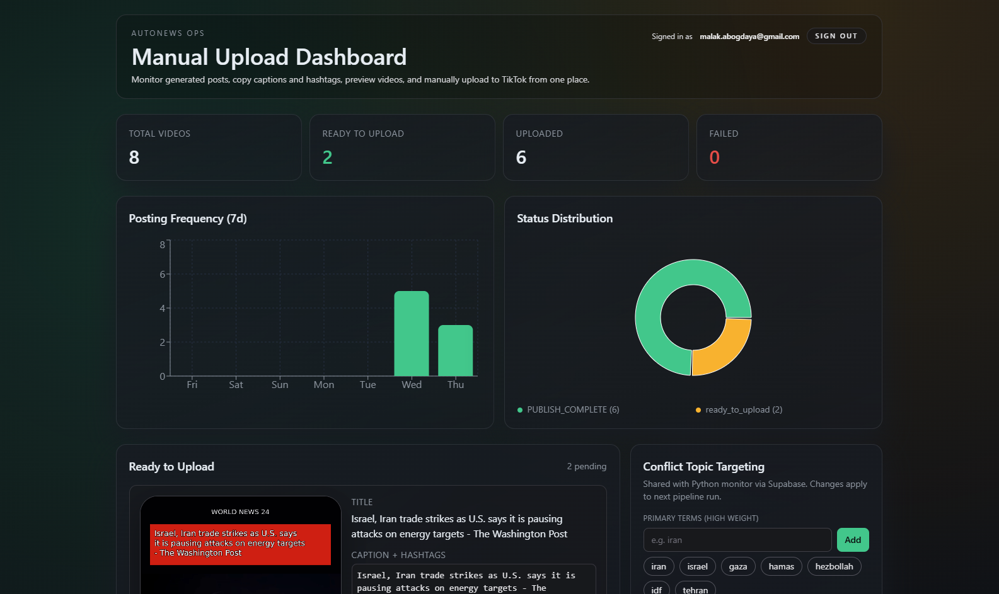

# AutoNews

AutoNews is an automated news-to-video pipeline for short-form content. It fetches breaking stories, ranks them, writes a TikTok-style script and caption with AI, generates voiceover and video assets, stores finished videos, and exposes a dashboard for review and upload.

The repository contains two main parts:

- A Python backend pipeline for story selection, script generation, voice synthesis, video rendering, storage, and upload orchestration
- A Next.js dashboard for monitoring generated videos and manually triggering TikTok uploads

## Features

- Pulls fresh stories from NewsAPI and RSS feeds
- Scores headlines by urgency and topic relevance
- Uses OpenAI to generate short-form scripts and captions
- Uses ElevenLabs to produce voiceovers
- Renders vertical videos with FFmpeg
- Uploads finished videos to Supabase Storage
- Logs generated videos and used stories in Supabase
- Supports scheduled generation through APScheduler
- Includes a dashboard for monitoring queue status and manual TikTok upload flow

## How It Works

1. Fetch news stories from RSS feeds and NewsAPI
2. Filter out stories already used
3. Rank stories by conflict relevance and headline strength
4. Generate a short script and TikTok caption
5. Convert the script into voiceover audio
6. Render a vertical video with headline overlay and captions
7. Upload the video to storage and log metadata in Supabase
8. Review and upload ready videos from the dashboard or upload API

## Repository Structure

```text
.
├── agent/               # Story selection and AI writing logic
├── db/                  # Supabase access helpers and topic config
├── media/               # Audio, captions, storage, and video rendering
├── scheduler/           # Scheduled pipeline runner
├── tiktok/              # OAuth, manual upload, and uploader integration
├── dashboard/           # Next.js monitoring dashboard
├── tests/               # Manual pipeline and video test scripts
├── main.py              # One-shot pipeline entrypoint
├── api_server.py        # Upload API for dashboard-triggered uploads
├── config.py            # Environment variable loading
├── docker-compose.yml   # Python services for scheduler and upload API
└── Dockerfile           # Container image for backend services
```

## Architecture

### Backend pipeline

- `main.py` runs the pipeline once for one or more stories
- `scheduler/jobs.py` runs the pipeline on an interval
- `agent/monitor.py` fetches and ranks stories
- `agent/writer.py` generates script and caption text
- `media/audio.py` creates the voiceover
- `media/video.py` renders the final short-form video
- `media/storage.py` uploads videos to Supabase Storage
- `db/models.py` records generated videos and used stories

### Upload flow

- `api_server.py` exposes a protected HTTP endpoint for uploads
- `tiktok/manual_upload.py` resolves a stored video and submits it to TikTok
- The dashboard calls the upload API because Vercel cannot run the local Python upload process directly

### Dashboard

- Built with Next.js 14 in `dashboard/`
- Displays queue status, metrics, charts, and ready-to-upload videos
- Supports TikTok OAuth token storage and manual upload actions

For dashboard-specific details, see `dashboard/README.md`.

## Requirements

### System requirements

- Python 3.12 recommended
- Node.js 18 or newer for the dashboard
- FFmpeg installed locally if you run the video renderer outside Docker
- A Supabase project for database and optional storage
- API credentials for OpenAI, ElevenLabs, NewsAPI, and TikTok

### Python dependencies

Install backend dependencies with:

```bash
pip install -r requirements.txt
```

### Dashboard dependencies

```bash
cd dashboard
npm install
```

## Environment Variables

Create a root `.env` file for the Python services.

```env
OPENAI_API_KEY=
ELEVENLABS_API_KEY=
ELEVENLABS_VOICE_ID=
ELEVENLABS_MODEL_ID=
NEWS_API_KEY=
SUPABASE_URL=
SUPABASE_KEY=
SUPABASE_STORAGE_BUCKET=
SUPABASE_STORAGE_PUBLIC=true
SUPABASE_STORAGE_SIGNED_EXPIRES=3600
OUTPUT_DIR=./output
TIKTOK_CLIENT_KEY=
TIKTOK_CLIENT_SECRET=
TIKTOK_REDIRECT_URI=
TIKTOK_ACCESS_TOKEN=
TIKTOK_REFRESH_TOKEN=
TIKTOK_DRY_RUN=true
API_SECRET=
PORT=8080
```

Create `dashboard/.env.local` for the Next.js app.

```env
NEXT_PUBLIC_SUPABASE_URL=
NEXT_PUBLIC_SUPABASE_ANON_KEY=
SUPABASE_SERVICE_ROLE_KEY=
TIKTOK_CLIENT_KEY=
TIKTOK_CLIENT_SECRET=
TIKTOK_REDIRECT_URI=
PROJECT_ROOT=
ORACLE_API_SECRET=
ORACLE_API_BASE_URL=
```

## Database Setup

The project expects at least these Supabase tables:

- `videos`
- `used_stories`
- `pipeline_settings`
- `tiktok_tokens`

Minimal example for topic settings:

```sql
create table if not exists public.pipeline_settings (
  key text primary key,
  value jsonb not null default '{}'::jsonb,
  updated_at timestamptz not null default now()
);
```

The backend reads the `conflict_topics` key from `pipeline_settings` to tune story selection.

Example token storage table:

```sql
create table if not exists public.tiktok_tokens (
  id text primary key,
  access_token text,
  refresh_token text,
  expires_at timestamptz,
  refresh_expires_at timestamptz,
  scope text,
  token_type text,
  open_id text,
  updated_at timestamptz
);
```

## Local Development

### Run the pipeline once

```bash
python main.py --story-limit 1
```

### Run the scheduler

```bash
python scheduler/jobs.py
```

### Run the upload API

```bash
python api_server.py
```

The upload API exposes:

- `GET /health`
- `POST /api/upload/<video_id>` with header `X-API-Secret: <API_SECRET>`

### Run the dashboard

```bash
cd dashboard
npm run dev
```

Open `http://localhost:3000`.

## Docker

Build and run the Python services with Docker Compose:

```bash
docker compose up --build
```

This starts:

- `scheduler` running the automated generation loop
- `upload-api` running on port `8080`

The Docker image installs FFmpeg and DejaVu fonts so video rendering works inside the container.

## Deployment

The repository includes `deploy.sh` for a simple Docker-based deployment flow on a remote Linux host. The current deployment model is:

- Python scheduler container runs continuously
- Upload API container runs continuously on port `8080`
- Next.js dashboard can be deployed separately, for example on Vercel
- The dashboard calls the upload API on the remote host when a user triggers manual upload

## Demo Video In The GitHub README

Use a repository thumbnail image linked to a hosted full-quality video.

Current setup:

```md
[](https://github.com/MalakGdaea/AutoNews/releases/download/v1.0.0/demo.mp4)
```

This keeps the README lightweight while still giving one-click access to the full demo.

## Notes

- Generated videos are written to `output/`
- Temporary images and test assets may be written under `media/temp/`
- If `SUPABASE_STORAGE_BUCKET` is not set, videos stay local and are not uploaded to storage
- The dashboard prefers `video_url` when previewing a generated video

## Testing

The repository includes manual test scripts in `tests/` for pipeline and video generation. They are useful for local verification but are not structured as a formal automated test suite yet.

## License

Licensed under the MIT License. See [LICENSE](LICENSE).
